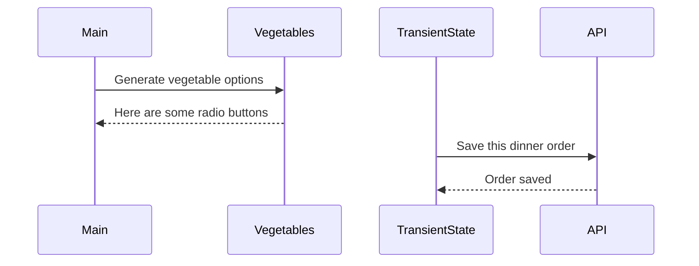

# Events and State Self-Assessment

> 🧨 Make sure you answer the vocabulary and understanding questions at the end of this document before notifying your coaches that you are done with the project

## Setup

1. Make sure you are in your `workspace` directory
1. `git clone {github repo SSH string}`
1. `cd` into the directory it creates
1. `code .` to open the project code
1. Use the `serve` command to start the web server
1. Open the URL provided in Chrome

## Requirements

### Initial Render

1. All 10 base dishes should be displayed as radio input options.
1. All 9 vegetables should be displayed as radio input options.
1. All 6 side dishes should be displayed as radio input options.
1. All previously purchases meals should be displayed below the meal options. Each purchase should display the primary key and the total cost of the purcahsed meal.

### State Management

1. When the user selects an item in any of the three columns, the choice should be stored as transient state.
1. When a user makes a choice for all three kinds of food, and then clicks the "Purchase Combo" button, a new sales object should be...
    1. Stored as permanent state in your local API.
    1. Represented as HTML below the **Monthly Sales** header in the following format **_exactly_**. Your output will not have zeroes, but the actual amount.
        ```html
        Receipt #1 = $00.00
        ```
   1. The user's choices should be cleared from transient state once the purchase is made.

## Design

Given the description and animation above...

1. Create an ERD for this application before you begin.
1. Make a list of what modules need to be created to make your application as modular as possible. Create a **Dependency Graph** for the project to be reviewed once you are complete with the assessment.
1. Create a **Sequence Diagram** that visualizes what your algorithm is for this project. We'll give you a minimal starting point.



## Vocabulary and Understanding

> 🧨 Before you click the "Assessment Complete" button on the Learning Platform, add your answers below for each question and make a commit. It is your option to request a face-to-face meeting with a coach for a vocabulary review.

1. Should transient state be represented in a database diagram? Why, or why not?
   >  No, because transient state data isn't added to the database unless we tell it to be added. It acts like a place holder for object properties that can be changed before it's added, so the transient state data itself is never apart of the database. 
2. In the **FoodTruck** module, you are **await**ing the invocataion of all of the component functions _(e.g. sales, veggie options, etc.)_. Why must you use the `await` keyword there? Explain what happens if you remove it.
   > Await is used to pause the function at a specific point to wait for a promise's "answer"/value it's returning. Without await you would'nt get the result you need to keep going in the function. You are left with a pending promise with no value.
3. When the user is making choices by selecting radio buttons, explain how that data is retained so that the **Purchase Combo** button works correctly.
   > Inside of the transient state module there is a transient object that can be changed depending on the users choice and then stored in the database. To do this there are four functions in the transient state module, three of them are linked to the three properties in the transient state object. One for each menu id: entreeId, vegetableId, and sideId, and once an option is selected the transient state object has its property value changed to the id value of the selected option (like storing the value somewhere). All three functions can be imported to their respective modules where that choice is being made and invoked in an event function which allows the id values of the transient state object to change if the targets data type name matches what we specify in the if statement. 
4. You used the `map()` array method in the self assessment _(at least, you should have since it is a learning objective)_. Explain why that function is helpful as a replacement for a `for..of` loop.
   > It's better to use than a for..of loop specifically when we are manipulating data in an array and want to keep the original array unchanged. The .map array method allows us to automatically create and return a new array without having to declare a container array and push items into that container array.   